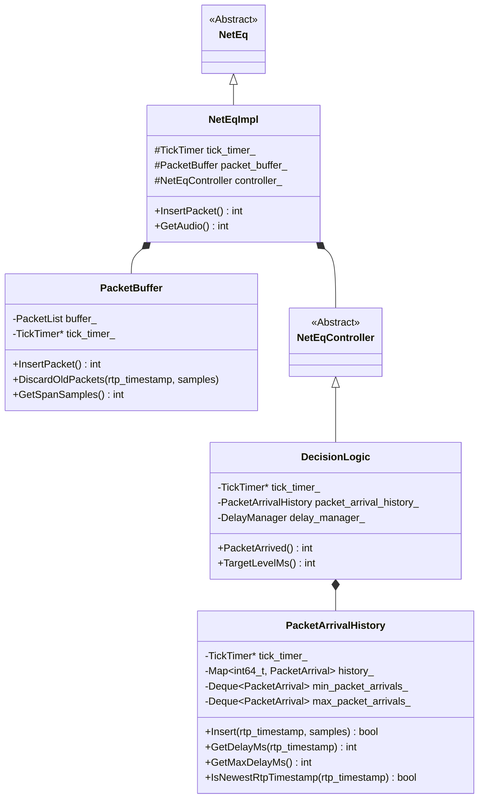

```mermaid
classDiagram
    NetEq <|-- NetEqImpl
    class NetEq
    <<Abstract>> NetEq
    class NetEqImpl {
        #TickTimer tick_timer_
        #PacketBuffer packet_buffer_
        #NetEqController controller_
        +InsertPacket() int
        +GetAudio() int
    }

    NetEqImpl *-- PacketBuffer
    class PacketBuffer {
        -PacketList buffer_
        %% Pointing to TickTimer::tick_timer_
        -TickTimer* tick_timer_
        %% 1) Record the tick value for each packet arrival
        %% 2) Insert at the appropriate position according to timestamp
        +InsertPacket() int
        %% Discard all packets with timestamp in range (rtp_timestamp - samples, rtp_timestamp)
        +DiscardOldPackets(rtp_timestamp, samples)
        %% Calculate RTP timestamp span (from last packet's end or from now)
        +GetSpanSamples() int
    }

    NetEqImpl *-- NetEqController
    NetEqController <|-- DecisionLogic
    class NetEqController
    <<Abstract>> NetEqController
    class DecisionLogic {
        %% Pointing to TickTimer::tick_timer_
        -TickTimer* tick_timer_
        -PacketArrivalHistory packet_arrival_history_
        -DelayManager delay_manager_
        +PacketArrived() int
        +TargetLevelMs() int
    }

    DecisionLogic *-- PacketArrivalHistory
    class PacketArrivalHistory {
        %% Pointing to TickTimer::tick_timer_
        -TickTimer* tick_timer_
        %% Sorted by rtp_timestamp
        -Map~int64_t, PacketArrival~ history_
        %% fast -> slower
        -Deque~PacketArrival~ min_packet_arrivals_
        %% slow -> faster
        -Deque~PacketArrival~ max_packet_arrivals_
        +Insert(rtp_timestamp, samples) bool
        +GetDelayMs(rtp_timestamp) int
        +GetMaxDelayMs() int
        +IsNewestRtpTimestamp(rtp_timestamp) bool
    }
```
