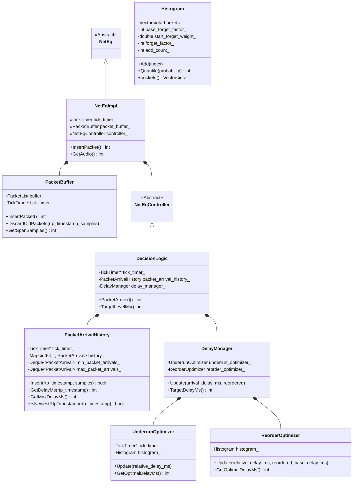

```mermaid
classDiagram
    NetEq <|-- NetEqImpl
    class NetEq
    <<Abstract>> NetEq
    class NetEqImpl {
        #TickTimer tick_timer_
        #PacketBuffer packet_buffer_
        #NetEqController controller_
        +InsertPacket() int
        +GetAudio() int
    }

    NetEqImpl *-- PacketBuffer
    class PacketBuffer {
        -PacketList buffer_
        %% Pointing to NetEqImpl::tick_timer_
        -TickTimer* tick_timer_
        %% 1) Record the tick value for each packet arrival
        %% 2) Insert at the appropriate position according to timestamp
        +InsertPacket() int
        %% Discard all packets with timestamp in range (rtp_timestamp - samples, rtp_timestamp)
        +DiscardOldPackets(rtp_timestamp, samples)
        %% Calculate RTP timestamp span (from last packet's end or from now)
        +GetSpanSamples() int
    }

    NetEqImpl *-- NetEqController
    NetEqController <|-- DecisionLogic
    class NetEqController
    <<Abstract>> NetEqController
    class DecisionLogic {
        %% Pointing to NetEqImpl::tick_timer_
        -TickTimer* tick_timer_
        -PacketArrivalHistory packet_arrival_history_
        -DelayManager delay_manager_
        +PacketArrived() int
        +TargetLevelMs() int
    }

    DecisionLogic *-- PacketArrivalHistory
    class PacketArrivalHistory {
        %% Pointing to NetEqImpl::tick_timer_
        -TickTimer* tick_timer_
        %% Sorted by rtp_timestamp
        -Map~int64_t, PacketArrival~ history_
        %% fast -> slower
        -Deque~PacketArrival~ min_packet_arrivals_
        %% slow -> faster
        -Deque~PacketArrival~ max_packet_arrivals_
        +Insert(rtp_timestamp, samples) bool
        +GetDelayMs(rtp_timestamp) int
        +GetMaxDelayMs() int
        +IsNewestRtpTimestamp(rtp_timestamp) bool
    }

    DecisionLogic *-- DelayManager
    class DelayManager {
        -UnderrunOptimizer underrun_optimizer_
        -ReorderOptimizer reorder_optimizer_
        %% Considering the outputs of two optimizers comprehensively, calculate the optimal result
        +Update(arrival_delay_ms, reordered)
        %% Get result
        +TargetDelayMs() int
    }

    DelayManager *-- UnderrunOptimizer
    class UnderrunOptimizer {
        %% Pointing to NetEqImpl::tick_timer_
        -TickTimer* tick_timer_
        -Histogram histogram_
        +Update(relative_delay_ms)
        +GetOptimalDelayMs() int
    }

    DelayManager *-- ReorderOptimizer
    class ReorderOptimizer {
        Histogram histogram_
        +Update(relative_delay_ms, reordered, base_delay_ms)
        +GetOptimalDelayMs() int
    }

    class Histogram {
        -Vector~int~ buckets_
        -int base_forget_factor_
        -double start_forget_weight_
        -int forget_factor_
        -int add_count_
        +Add(index)
        +Quantile(probability) int
        +buckets() Vector~int~
    }
```
